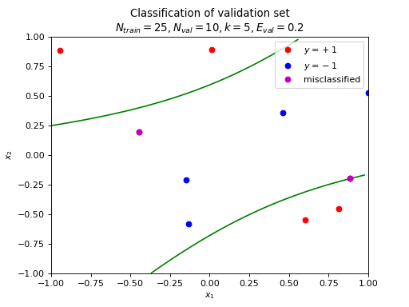

# machine-learning-mooc
During the summer of 2021 I succesfully completed Dr. Yaser Abu Mustafas MOOC course "learning from data" freely avaible online. These are my answers to all homework questions in addition to the final.

Here is the official MOOC website: https://work.caltech.edu/telecourse, containing all relevant course material.

There are all the existing video lectures (which I carefully watched through):

Lecture 1: The Learning Problem

Lecture 2: Is Learning Feasible?

Lecture 3: The Linear Model I

Lecture 4: Error and Noise

Lecture 5: Training versus Testing

Lecture 6: Theory of Generalization

Lecture 7: The VC Dimension

Lecture 8: Bias-Variance Tradeoff

Lecture 9: The Linear Model II

Lecture 10: Neural Networks

Lecture 11: Overfitting

Lecture 12: Regularization

Lecture 13: Validation

Lecture 14: Support Vector Machines

Lecture 15: Kernel Methods

Lecture 16: Radial Basis Functions

Lecture 17: Three Learning Principles

Lecture 18: Epilogue

These are all the topics machine learning topics covered in the course: https://work.caltech.edu/library/

Here comes a bunch of plots that I've made during the run of these course, hopefully, they are a little bit inspirational.

